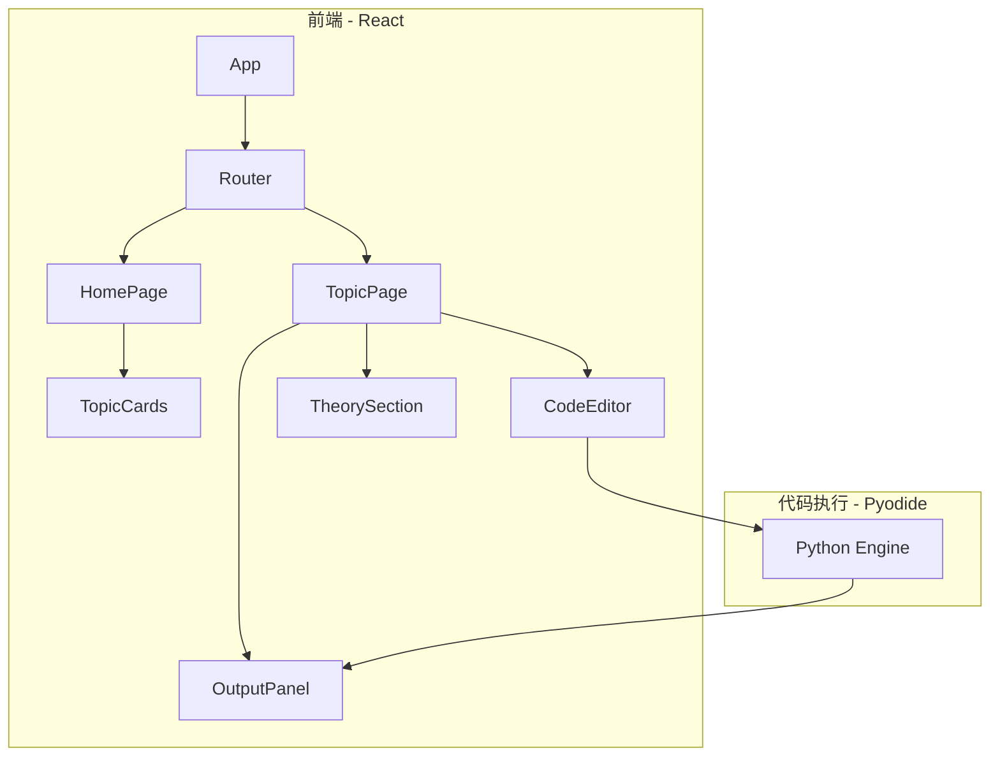

## 1. Architecture Design



## 2. Technology Description
- **Frontend**: React@18 + TypeScript + Tailwind CSS@3 + Vite
- **Initialization Tool**: vite-init
- **Code Execution**: Pyodide (在浏览器中运行Python)
- **Editor Component**: Monaco Editor / CodeMirror
- **Icons**: lucide-react
- **State Management**: React useState/useEffect (轻量级)

## 3. Route Definitions

| Route | Purpose |
|-------|---------|
| / | 首页 - 展示10个主题卡片 |
| /topic/:id | 主题详情页 - 理论介绍和代码练习 |

## 4. Data Model

### 4.1 Topic Data Structure
```typescript
interface Topic {
  id: number;
  title: string;
  description: string;
  difficulty: 'beginner' | 'intermediate' | 'advanced';
  icon: string;
  color: string;
  theory: string;
  code: string;
}
```

### 4.2 10个主题初始数据
- 主题1: Python基础
- 主题2: 数据清洗
- 主题3: 数据可视化
- 主题4: 统计分析
- 主题5: Excel数据分析
- 主题6: 机器学习入门
- 主题7: 时间序列分析
- 主题8: 客户分群
- 主题9: A/B测试
- 主题10: 数据报告撰写

## 5. Project Structure

```
/workspace
├── src/
│   ├── main.tsx
│   ├── App.tsx
│   ├── components/
│   │   ├── Header.tsx
│   │   ├── TopicCard.tsx
│   │   ├── CodeEditor.tsx
│   │   └── OutputPanel.tsx
│   ├── pages/
│   │   ├── HomePage.tsx
│   │   └── TopicPage.tsx
│   ├── data/
│   │   └── topics.ts
│   ├── utils/
│   │   └── pyodide.ts
│   └── index.css
├── package.json
├── tsconfig.json
├── vite.config.ts
├── tailwind.config.js
└── postcss.config.js
```

## 6. Key Implementation Points

1. **Pyodide Integration**: 在浏览器中加载Pyodide WASM，提供Python运行环境
2. **Code Editor**: 使用Monaco Editor提供语法高亮和编辑功能
3. **Responsive Layout**: Tailwind响应式设计，适配不同屏幕
4. **Topic Navigation**: React Router实现页面路由
5. **State Management**: React内置状态管理，简单高效
