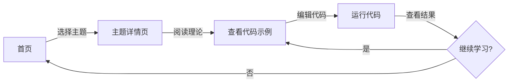

## 1. Product Overview
商务数据分析与应用训练网站是一个互动式学习平台，提供10个数据科学主题的实践训练，每个主题都配有可直接运行的代码示例，帮助用户掌握商务数据分析技能。

## 2. Core Features

### 2.1 User Roles
| Role | Registration Method | Core Permissions |
|------|---------------------|------------------|
| Learner |无需注册 |浏览所有主题，运行代码，编辑练习|

### 2.2 Feature Module
1. **首页**: 主题列表展示，导航
2. **主题详情页**: 10个数据科学主题，每个包含理论介绍、代码示例、编辑器
3. **代码编辑器**: 可编辑、运行Python/JavaScript代码，查看输出结果

### 2.3 Page Details
| Page Name | Module Name | Feature description |
|-----------|-------------|---------------------|
| 首页 | Hero区域 | 展示平台愿景和核心价值 |
| 首页 | 主题卡片 | 展示10个数据科学主题，点击进入详情 |
| 主题详情页 | 理论介绍 | 详细讲解该主题的核心概念 |
| 主题详情页 | 代码示例 | 预置可运行的示例代码 |
| 主题详情页 | 代码编辑器 | 支持代码编辑、运行、重置 |
| 主题详情页 | 输出区域 | 显示代码运行结果 |

## 3. Core Process
用户访问首页 → 选择感兴趣的主题 → 阅读理论介绍 → 查看示例代码 → 在编辑器中修改并运行代码 → 查看输出结果 → 继续学习或返回首页选择其他主题

## 4. User Interface Design
### 4.1 Design Style
- 主色调: 蓝色系 (#0ea5e9, #0284c7)
- 辅助色: 中性灰 (#1e293b, #475569)
- 按钮风格: 圆角矩形，平滑阴影
- 字体: Inter 系统字体，清晰易读
- 布局风格: 卡片式，模块化布局
- 图标: 使用 lucide-react 图标库

### 4.2 Page Design Overview
| Page Name | Module Name | UI Elements |
|-----------|-------------|-------------|
| 首页 | Hero区域 | 渐变背景，大标题，简短描述 |
| 首页 | 主题卡片 | 彩色卡片，悬停动画，包含主题名、简短描述和难度 |
| 主题详情页 | 内容区 | 左右布局：左侧理论，右侧代码编辑器 |
| 主题详情页 | 代码编辑器 | 深色主题，行号显示，语法高亮 |
| 主题详情页 | 输出区 | 浅色背景，清晰展示运行结果 |

### 4.3 Responsiveness
采用响应式设计，桌面端为主，平板和移动端自适应。

### 4.4 10个主题列表
1. **Python基础** - 数据分析必备的Python语法
2. **数据清洗** - 处理缺失值、异常值
3. **数据可视化** - 使用Matplotlib/Seaborn绘图
4. **统计分析** - 描述性统计、假设检验
5. **Excel数据分析** - 使用pandas处理表格数据
6. **机器学习入门** - 回归与分类算法
7. **时间序列分析** - 预测未来趋势
8. **客户分群** - K-means聚类分析
9. **A/B测试** - 产品效果评估
10. **数据报告撰写** - 数据故事化呈现
